# Microsoft Entra PIM Just-in-Time Role Activation


## Project Overview

This project demonstrates how Microsoft Entra Privileged Identity Management (PIM) can provide temporary, just-in-time administrative access. Instead of permanently assigning privileged access, a test user receives an **eligible** Helpdesk Administrator role and activates it only when the access is needed.

The lab documents the complete manual access lifecycle—eligibility, activation, verification, and deactivation—and begins the Microsoft Graph PowerShell automation phase. It demonstrates practical IAM concepts such as least privilege, time-bound access, MFA-aware authentication, administrative consent, and troubleshooting.

## Business Scenario

An organization needs its help desk staff to perform occasional administrative tasks, but permanent administrator access would create unnecessary security exposure. Microsoft Entra PIM solves this problem by allowing approved users to activate a role for a limited period and then automatically or manually remove the elevated access.

This matters to a business because compromised permanent administrator accounts can cause widespread damage. Time-limited access reduces the attack window while retaining an auditable record of who received elevated access and when.

## Objectives

- Configure a time-limited, PIM-eligible role assignment.
- Apply the principle of least privilege with the Helpdesk Administrator role.
- Activate eligible access temporarily as the assigned test user.
- Verify that the activated role appears as an active assignment.
- Deactivate elevated access when it is no longer required.
- Install and connect Microsoft Graph PowerShell for future automation.
- Document authentication and consent problems encountered during testing.

## Technologies Used

- Microsoft Entra ID
- Microsoft Entra Privileged Identity Management
- Microsoft Graph PowerShell SDK
- PowerShell 7 on macOS
- Multi-Factor Authentication
- GitHub Markdown

## Project Workflow

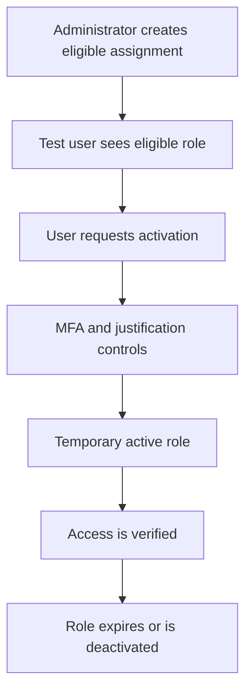

## Implementation

### 1. Verify the Initial PIM State

The Eligible assignments page initially showed no results. This established the starting state and confirmed that the test user did not already possess an eligible privileged role.

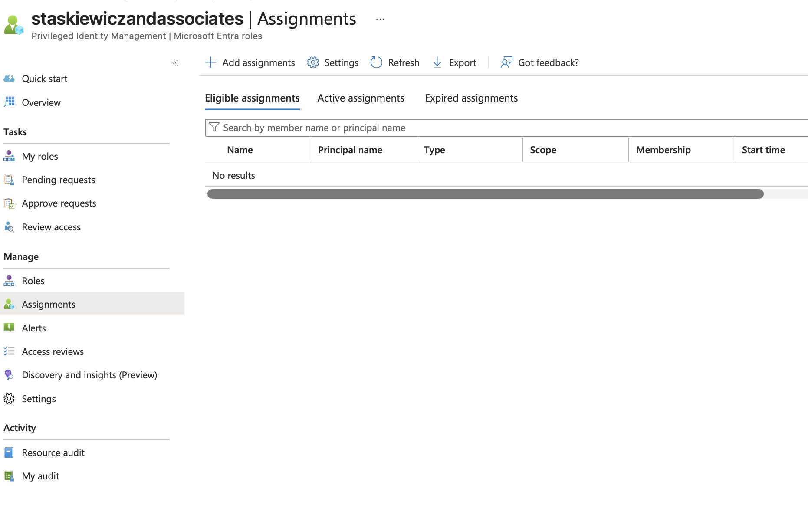

### 2. Select the Role and Test User

The Helpdesk Administrator role was selected at directory scope and assigned to the lab user, Aaron Campbell. A lower-impact administrative role was deliberately chosen instead of Global Administrator.

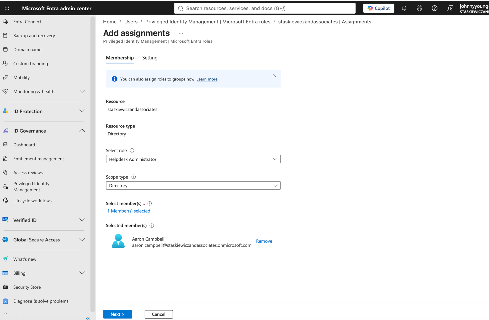

### 3. Configure an Eligible Assignment

The Helpdesk Administrator role was assigned as **Eligible**, not Active. Permanent eligibility was disabled so that the assignment would have a defined start and end date.

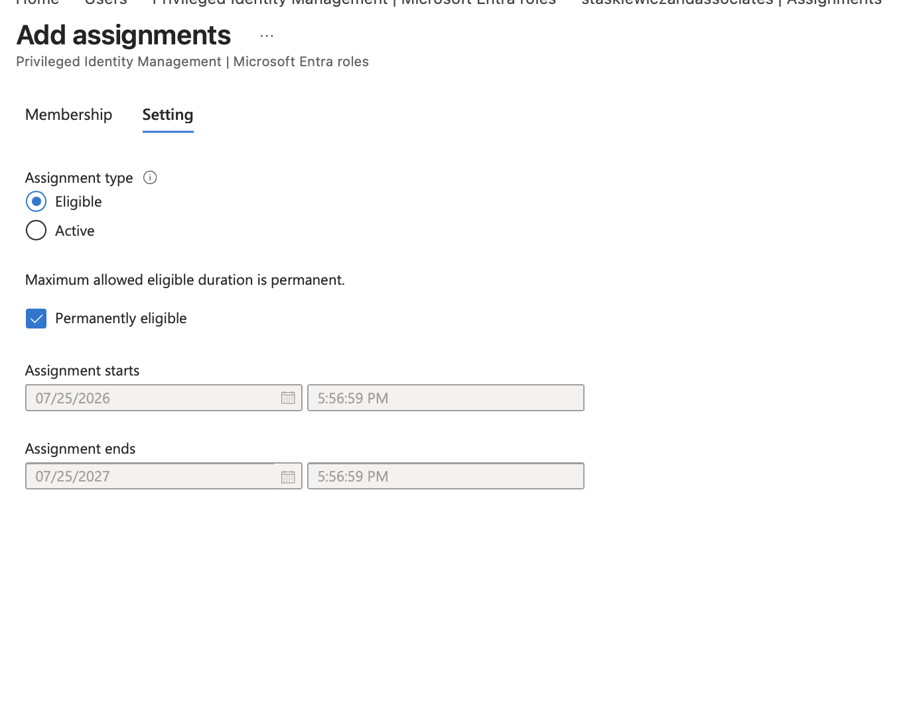

This distinction is important: an eligible user does not receive administrator privileges immediately. The user must activate the role when it is required.

### 4. Correct the Maximum-Duration Validation Error

The original end date exceeded the maximum duration allowed by the role policy. Entra blocked the request and displayed a validation message. The end date was corrected to a 30-day period before the assignment was submitted again.

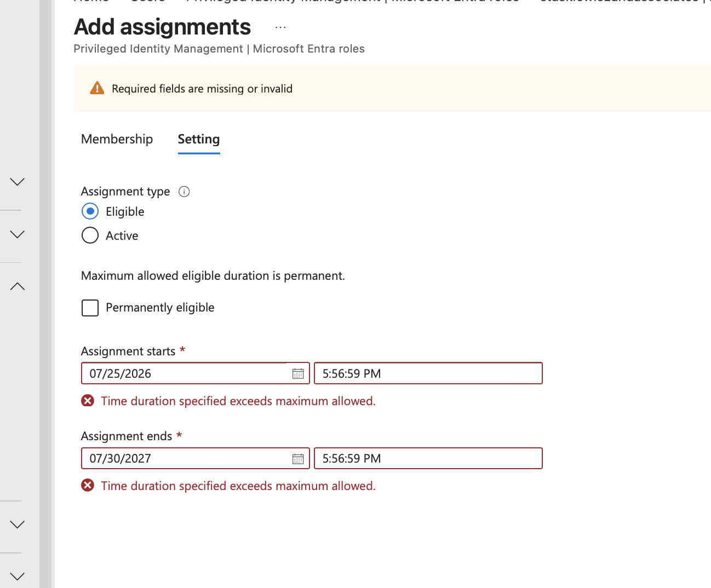

This validation demonstrates that PIM role policies can enforce governance rules before privileged access is granted.

### 5. Confirm the Time-Limited Eligible Assignment

After correcting the dates, Aaron Campbell received an eligible Helpdesk Administrator assignment. The assignment was configured for a limited period and did not provide immediate active privileges.

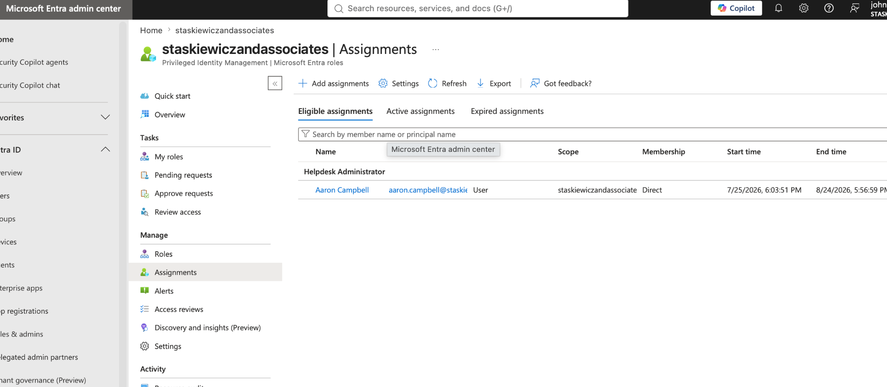

### 6. Verify the Role from the User's Perspective

The test user signed in and opened **PIM → My roles → Microsoft Entra roles → Eligible assignments**. The Helpdesk Administrator role appeared with an **Activate** action.

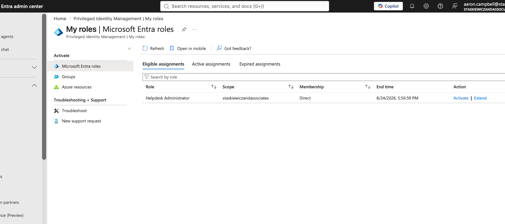

### 7. Activate Just-in-Time Access

The user activated the eligible role for a limited period. The Active assignments page displayed the Helpdesk Administrator role, its activation state, and its expiration time.

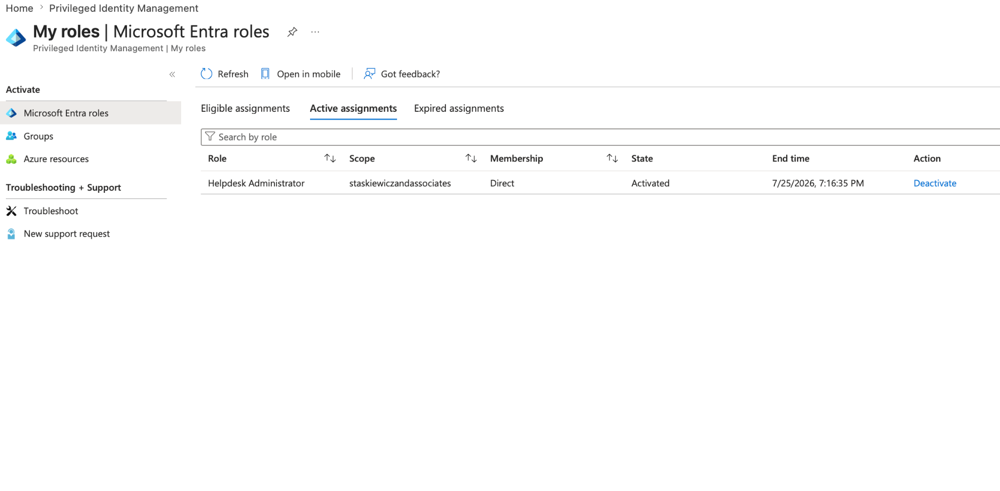

The role could also be deactivated before expiration. This supports least privilege by removing elevated access as soon as the administrative work is complete.

### 8. Verify the Expected Helpdesk Permission

While the role was active, Aaron opened a separate lab user and confirmed that the **Reset password** action was available. The password did not need to be changed—the visible action was enough to demonstrate that the temporary Helpdesk Administrator permission was effective.

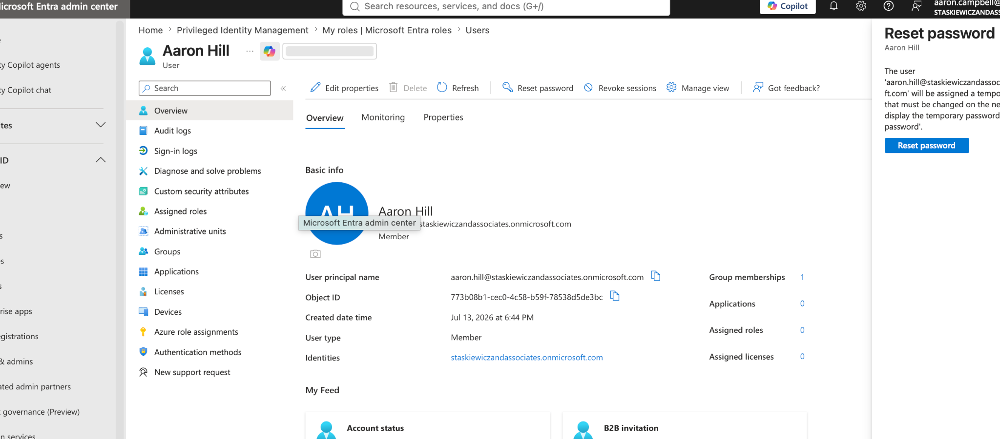

### 9. Deactivate the Temporary Role

The deactivation panel showed the assigned member, role, activation start time, and scheduled end time. Deactivation removes the temporary administrator privilege immediately while leaving the underlying eligible assignment available until its eligibility end date.

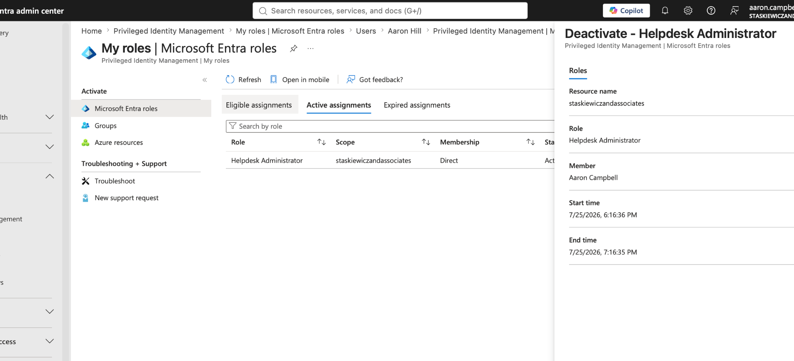

## PowerShell and Microsoft Graph Automation

### 10. Connect to Microsoft Graph

PowerShell was connected to Microsoft Graph using delegated permissions. This provides the foundation for retrieving PIM assignments and automating eligible-role operations.

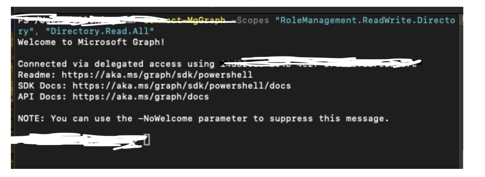

### 11. Confirm the Graph Context and Role Definitions

`Get-MgContext` verified the signed-in account, tenant, and delegated scopes. The role-definition query then returned the available Microsoft Entra roles, proving that Microsoft Graph could read directory role metadata.

```powershell
Get-MgContext | Format-List Account,TenantId,Scopes

Get-MgRoleManagementDirectoryRoleDefinition |
  Select-Object DisplayName, Id |
  Sort-Object DisplayName |
  Format-Table -AutoSize
```

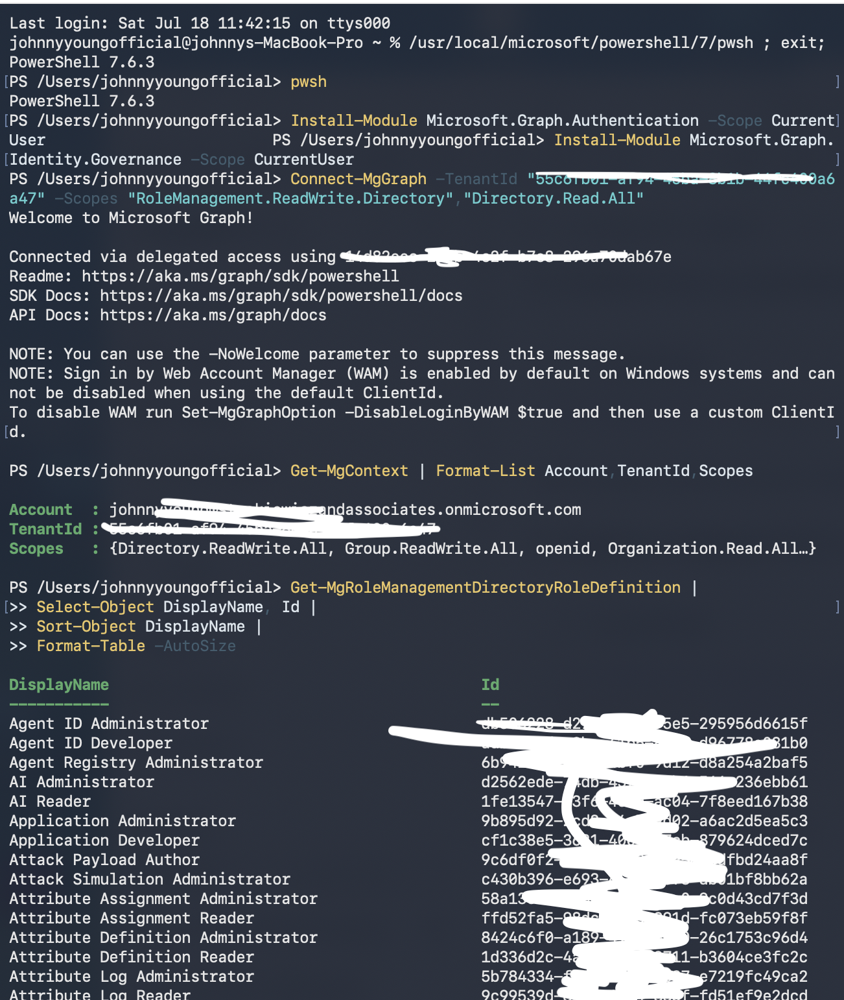

### 12. Build the Eligibility Query

The PowerShell workflow queried eligible schedules and converted the returned principal and role IDs into readable user, email, role, and status fields.

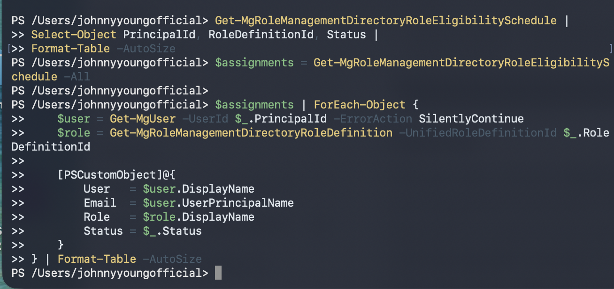

### 13. Install the Required Graph Modules

The Microsoft Graph Authentication and Identity Governance modules were installed for the current macOS user.

```powershell
Install-Module Microsoft.Graph.Authentication -Scope CurrentUser
Install-Module Microsoft.Graph.Identity.Governance -Scope CurrentUser
```

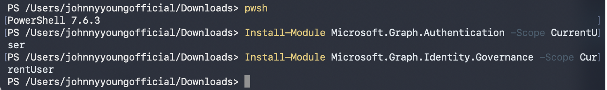

### 14. Retrieve the Eligible Assignment

The first retrieval attempt returned `Authentication needed. Please call Connect-MgGraph`. The Graph session had expired or had not completed successfully, so the returned table was empty.

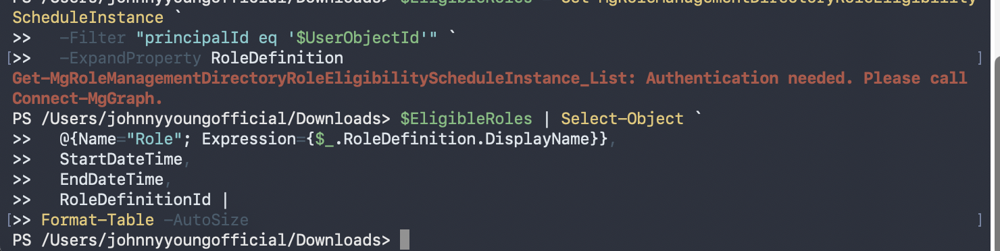

The reconnect workflow requested the minimum relevant delegated scopes:

```powershell
Connect-MgGraph `
  -Scopes "RoleEligibilitySchedule.Read.Directory", `
          "RoleAssignmentSchedule.ReadWrite.Directory", `
          "User.Read" `
  -UseDeviceAuthentication
```

### 15. Resolve Administrator Consent

Because the test user could not approve organization-wide Graph permissions, Microsoft displayed an administrator-approval requirement. An administrator must grant tenant consent, after which the test user can reconnect and perform delegated operations within the permissions they are authorized to use.


### 16. Bypass the Failed Localhost Callback

The browser redirect to localhost failed after interactive authentication. Device-code authentication was selected as the alternative because it does not depend on the local callback listener.


## Reusable Assignment Script

The included [`scripts/Assign-EntraPIMEligibleRole.ps1`](scripts/Assign-EntraPIMEligibleRole.ps1) script creates a time-limited eligible role assignment. It validates the user and role, checks for an existing assignment, displays a summary, and requires confirmation before submitting the change.

Example:

```powershell
./scripts/Assign-EntraPIMEligibleRole.ps1 `
  -UserObjectId "PASTE-USER-OBJECT-ID-HERE" `
  -RoleName "Helpdesk Administrator" `
  -DurationDays 30
```

Do not commit passwords, access tokens, client secrets, or MFA codes to a public repository.

## Current Project Status

Completed:

- Created the time-limited eligible Helpdesk Administrator assignment.
- Verified the role from the assigned user's account.
- Activated the role temporarily through PIM.
- Confirmed the temporary active assignment and expiration time.
- Verified the expected Helpdesk Administrator password-reset capability.
- Opened the deactivation workflow to remove temporary access.
- Queried Microsoft Entra role definitions with Microsoft Graph.
- Installed the Microsoft Graph modules.
- Documented authentication, administrator-consent, and callback troubleshooting.

Next phase:

- Complete tenant administrator consent for the required Graph permissions.
- Reconnect as the eligible test user using device-code authentication.
- Retrieve the eligible assignment from PowerShell.
- Automate the `selfActivate` request.
- Export activation information to a CSV audit log.
- Capture the successful terminal output and add it to this README.

## Key IAM Concepts Demonstrated

| Concept | How It Was Applied |
|---|---|
| Least privilege | A lower-impact Helpdesk Administrator role was used instead of Global Administrator. |
| Just-in-time access | The user activated privileged access only when required. |
| Time-bound access | Both eligibility and activation had defined expiration times. |
| Separation of duties | An administrator granted eligibility and consent; the eligible user performed activation. |
| Authentication security | MFA-aware delegated authentication and device-code sign-in were used. |
| Governance | Role policy prevented an assignment that exceeded the permitted duration. |
| Auditability | PIM and Microsoft Graph provide records of privileged-role assignment and activation activity. |

## Security and Privacy Note

The screenshots were created in a lab tenant. Before publishing a public repository, review every image and blur any email address, tenant domain, object ID, subscription information, or other identifier that you do not want publicly visible.

## Lessons Learned

This lab showed that PIM separates **eligibility** from **active privilege**. A user can be approved to request a role without holding that role continuously. It also demonstrated that Graph automation depends on both valid authentication and correctly approved permissions: a technically correct command still fails when the session has expired or tenant consent is missing.

## Repository Structure

```text
Entra-PIM-JIT-Role-Activation/
├── README.md
├── assets/
│   ├── 01-initial-eligible-assignments-empty.png
│   ├── 02-select-helpdesk-role-and-member.png
│   ├── 03-configure-eligible-assignment.png
│   ├── 04-duration-policy-validation-error.png
│   ├── 05-time-limited-eligible-assignment-created.png
│   ├── 06-user-eligible-role-available.png
│   ├── 07-temporary-role-activated.png
│   ├── 08-helpdesk-password-reset-permission-verified.png
│   ├── 09-role-deactivation-details.png
│   ├── 10-microsoft-graph-connected.png
│   ├── 11-graph-context-and-role-definitions.png
│   ├── 12-graph-eligibility-query-script.png
│   ├── 13-graph-modules-installed.png
│   ├── 14-graph-authentication-required.png
│   ├── 15-admin-approval-required.png
│   └── 16-localhost-callback-failed.png
└── scripts/
    └── Assign-EntraPIMEligibleRole.ps1
```

## Author

**Johnny Young**  
IAM / Cybersecurity Portfolio Project
